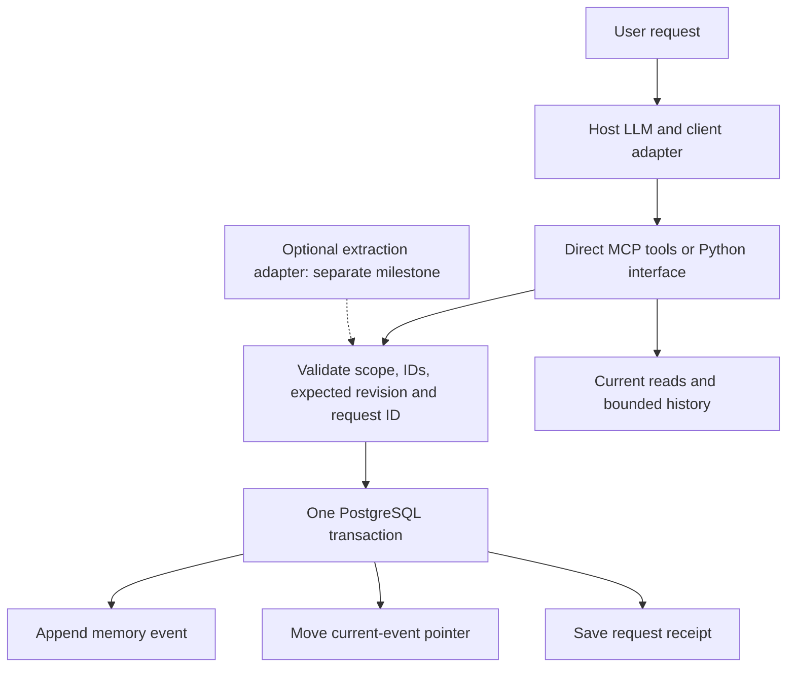

# Mnemo: integrated memory-tool implementation plan

Prepared September 21, 2026 against checkout `a194786`.

**Status: detailed proposal, ready to implement in milestones.** This document
combines the direct-write design and competitor research. It does not apply a
migration, change the production contract, or declare the quality target met.
It is the recommended execution order for the requested memory-tool direction;
the older research documents remain supporting evidence.

## 1. The product we are building

**Mnemo lets an agent save a memory, inspect its changes, and restore an exact
saved version without losing the history.**

The host LLM interprets the user's request and supplies the content or selects
the memory/version. Mnemo validates the operation and performs the database
change. The same store can later receive candidates from the existing optional
extraction pipeline. Direct writes and automatic extraction retain separate
quality measurements.

The first useful interaction is:

1. “Remember that I prefer PostgreSQL.” → create memory F, revision E1.
2. “Change that preference to MySQL.” → append E2 to F.
3. “What did you remember before?” → return the stored history.
4. “Undo that change.” → copy E1 into new revision E3.
5. “Which database do I prefer?” → read PostgreSQL from current memory.

F and E1–E3 are symbolic names here; the server returns actual UUIDs. Restoring
database state cannot erase the old MySQL statement from the host's chat context.
The host must use the successful tool result or read the current memory again.

### What success means

- **Storage correctness:** accepted changes are atomic, earlier payloads remain
  intact, stale requests fail, and retries cannot apply the same operation twice.
- **Agent usefulness:** the host chooses the correct memory/action, asks when
  the target is ambiguous, and answers using the resulting current state.
- **Content quality:** the submitted assertion is complete and supported by its
  source. This still depends on the host or optional extractor preparing it.

Reliable storage can preserve an incorrect assertion perfectly. Passing storage
tests must never be reported as fixing extraction accuracy.

## 2. What to combine from each implementation

### Mem0 → caller-controlled input and explicit memory IDs

Borrow the separation between supplied content and automatic extraction, plus
explicit updates by memory ID. Mem0 documents `infer=False` for raw input and
separate update/history operations. Direct input alone does not solve duplicate
identity or make submitted content true.
[Add](https://docs.mem0.ai/core-concepts/memory-operations/add),
[update](https://docs.mem0.ai/core-concepts/memory-operations/update),
[history](https://docs.mem0.ai/api-reference/memory/history-memory).

### Cognee → source lineage and portable data

Borrow source/run attribution and the discipline of preserving useful metadata
through export/import. Cognee's graph snapshots and failed-pipeline rollback are
different mechanisms from arbitrary historical memory restoration.
[Snapshots](https://github.com/topoteretes/cognee/blob/4294605f20324b250fd0edf8893cb69dc4215369/cognee/modules/migration/snapshot.py),
[pipeline rollback](https://github.com/topoteretes/cognee/blob/4294605f20324b250fd0edf8893cb69dc4215369/cognee/modules/cognify/rollback.py).

### Timescale Memory Engine → guarded restore and usable history

Borrow explicit restoration into a new version, concurrency guards, and bounded
history responses. Its documented MCP revert already implements a closely
related workflow. Versioning alone is therefore not a unique Mnemo feature.
[Revert](https://docs.memory.build/mcp/me_memory_revert/),
[history](https://docs.memory.build/mcp/me_memory_history/).

### Mnemo → retain the existing transactional event store

Keep Postgres, pgvector, raw SQL migrations, the immutable event payloads, and
the current-event pointer. Use existing event IDs as revision checks and add
durable request receipts. Implement these ideas with the current dependencies;
combining patterns does not require installing all three products.

The [comparison](MEMORY_SYSTEM_COMPARISON.md) and
[pinned source manifest](memory-system-research-sources.json) contain the audit
details. No competitor performance advantage is established by this research.

## 3. Release boundaries

### Pilot A: dependable preferences and attributes

- Local stdio MCP and a thin Python interface.
- One configured namespace/user/agent scope per server process.
- Nonempty string values; exact submitted wording is retained.
- One current value per scoped subject/predicate attribute.
- Create, get, search, update, history and guarded revert.
- Durable memories with no automatic expiry or decay in the pilot deployment.
- A dedicated pilot database, with no extraction/decay workers attached.
- Existing embeddings for writes/search; no internal extractor or verifier calls.

This is an opt-in interface. Existing `memory_add`, extraction clients and their
historical semantics remain available through the existing interface.

### Pilot B: independent memories

Add explicit identities for collection members and occurrences before describing
the tool as suitable for arbitrary classes, projects, skills or events. Two
classes sharing `attended_class` must coexist. A create-only attribute API can
reject a collision, but it cannot by itself represent those two memories.

### Later extensions

Portable export/import, guarded archive, and then action-group undo may follow
actual use. Automatic identity resolution, extraction improvements, graph
processing, consolidation, branching/merging and hosted multi-user access are
separate investments. They are not prerequisites for proving Pilot A.

## 4. Architecture and responsibilities



**Host/client:** selects the content and target, retains server-returned IDs,
generates a stable request UUID once per intended mutation, and reuses it across
transport retries. It must not reconstruct an old value from model recollection.

The adapter needs to retain that request ID across reconnects, not just in a
temporary HTTP/MCP transport counter. A generic MCP client that supplies a new
application request ID for each attempt does not get duplicate suppression
across those IDs. Demonstrate durable retries with the controlled adapter and
document this limit for unmodified clients; a prompt alone cannot guarantee it.

**MCP layer:** validates typed inputs, binds scope/actor from trusted local
configuration, returns structured results/errors, and advertises only the direct
tools in this profile. Tool arguments cannot select a different user or claim
human-review authority.

**Store:** enforces scope, ownership, state eligibility and transaction rules;
owns revision order, historical data and request receipts. Search similarity
finds candidates; it never authorizes an automatic merge or overwrite.

**Embedding adapter:** runs outside mutation locks for new content. After the
embedding completes, the transaction must recheck the expected revision. Revert
copies an eligible stored embedding and requires no extraction/generation call.
All embeddings must match the database's configured model/dimension contract.

## 5. Proposed direct API contract

These signatures describe the new profile, not today's public functions.

```text
memory_create(subject, predicate, value, request_id)
memory_get(fact_id, event_id=null)
memory_search(query, limit=5)
memory_update(fact_id, value, expected_event_id, request_id)
memory_history(fact_id, cursor=null, limit=20)
memory_revert(fact_id, to_event_id, expected_event_id, request_id)
```

### Creation and updates

- Create only: an occupied attribute identity returns `ALREADY_EXISTS` with no
  change. A matching successful request ID replays its receipt first.
- Update requires a returned fact ID and expected current event ID. Subject,
  predicate and scope cannot be changed through this call.
- Reject empty or whitespace-only values; retain the exact accepted string.
  Do not trim qualifiers, merge synonyms, or apply value aliases in this profile.
- An exact same-string update validates the expected revision, then returns a
  recorded `no_change` outcome. A different spelling is a real update here.
  Legacy `add` alias behavior remains explicitly covered by its existing tests.
- Continue existing identity canonicalization for Pilot A; introduce no new
  predicate aliases. Return the resolved identity so collisions are visible.

### Current reads and history

- Get without an event ID returns the current value, `fact_id` and
  `current_event_id`. With an event ID, it returns that exact scoped historical
  payload, its event ID, current revision at read time and restore eligibility.
  It verifies that the event belongs to the fact; it does not imply that the
  historical assertion is still current or eligible for restoration.
- Search returns those IDs with each current candidate and its relevance score.
  Direct-profile search excludes raw observation-cache entries.
- History returns event ID/sequence, operation, a value preview, source
  attribution, restoring actor when applicable, and the current revision at read
  time. Compute the page and its current-revision marker in one read snapshot.
- Default history page size 20, maximum 100. An opaque cursor binds the fact,
  scope, upper sequence boundary and page position; every page rechecks scope.
  A cursor must never act as authorization. New events do not reshuffle the
  already-started history traversal.
- Preview at most 256 characters and return `value_truncated` explicitly. Use
  get with the event ID for its exact value before deciding a restore when the
  preview omits relevant content. Pilot values have a proposed 8 KiB UTF-8
  maximum. This bounds responses without pretending a preview is the full fact.

### Restoration

- Require both the target event and the expected current event. Reject an
  out-of-date expectation even if the value changed A → B → A in the meantime.
- Target must belong to the same scoped fact and be an ADD/UPDATE/REVERT string
  snapshot eligible for the direct profile. Pilot eligibility requires durable
  tier, no session/expiry, and no finite/future world-validity constraint.
- Require the current fact to be active and eligible too. Archived, invalidated,
  session, expired or unsupported typed states receive `UNSUPPORTED_STATE`;
  restoring those states needs a later explicit contract.
- Copy saved assertion data and compatible embedding; append REVERT; move HEAD.
  `valid_from`/`recorded_at` describe the new restoration, not the original time.
  Preserve the target assertion's provenance/trust; separately record who
  requested restoration. Do not silently promote an agent action to human review.
- A different historical target appends a REVERT even if its text equals the
  current text, because its lineage can differ. Targeting the current event is
  an explicit validated `no_change` outcome.
- Record both the restored target and the displaced HEAD. “Undo the undo” selects
  that displaced HEAD. Keep the legacy `parent_event_id` interpretation intact.

### Responses and errors

Mutation results contain `status` (`applied` or `no_change`), `fact_id`, `event_id`,
`previous_event_id`, `restored_from_event_id` when applicable, exact value and
`request_id`. A response envelope may identify delivery as a receipt replay.
The stored operation result remains unchanged on replay. Its event ID is not a
promise that it is still current; the host uses get for the latest state.

Use MCP execution errors with stable structured codes: `INVALID_INPUT`,
`NOT_FOUND`, `ALREADY_EXISTS`, `REVISION_CONFLICT`, `INVALID_RESTORE_TARGET`,
`UNSUPPORTED_STATE`, `REQUEST_ID_REUSED`, and retryable service errors. A missing
or foreign restore target receives the same non-disclosing target error.
The installed MCP SDK must be checked for actual structured-result support.

## 6. Transactions, receipts and retention

### One mutation transaction

1. Validate input and trusted scope; prepare embeddings outside the transaction
   where needed. An optional early receipt read can avoid redundant work, but
   the receipt check inside the transaction remains authoritative.
2. Acquire the existing scoped advisory lock.
3. Check `(namespace, user_id, agent_id, request_id)`. Matching operation and
   validated semantic parameters return the original receipt. Different parameters
   return `REQUEST_ID_REUSED`. Compare before stale-revision checks so a successful
   request can be replayed after later legitimate changes.
4. Lock the relevant fact row, or check the create identity under the scope lock.
5. Validate current revision, fact state and target ownership/eligibility.
6. Append the event, mark supersession and move HEAD, or validate a no-op.
7. Insert the immutable successful/no-change receipt in the same transaction.
8. Commit and return the result. Any failure before commit leaves no partial
   event, HEAD change or success receipt.

Keep the existing coarse scope lock for correctness. Only replace it after
measurement demonstrates contention; retries/concurrency are already enough
new behavior for this milestone. Lock order remains scope → fact.

### Additive receipt migration

Use the [receipt SQL sketch](MEMORY_VERSIONING_MVP_RESEARCH.md) as the starting
point for the next free numbered migration (`0010` is currently free).
Required fields are scoped request ID, operation, validated request payload,
fact ID, resulting event ID, displaced event ID, restored target ID, stored
result and creation time. Add optional trusted action/source correlation and
the restoring actor if those fields are not already captured in the result.

- Scope plus request ID is unique across operation types.
- UUIDs and explicit defaults are normalized for request comparison; memory
  values remain exact. Do not hash only the text or use MCP transport IDs.
- IDs referenced by the receipt must belong to the same scoped fact. Plain
  foreign keys are insufficient for this relationship; check it transactionally.
- Guard receipt UPDATE/DELETE just as immutable event payloads are guarded.
- Store successful and no-change outcomes. Failed attempts create no success
  receipt; changing the command after a conflict requires a new request ID.
- Action IDs correlate one user's action; request IDs identify one mutation.
  They have different purposes. Grouped undo is not implied by having an action ID.
- New-event history must not duplicate an event when multiple no-change receipts
  reference it. Restoration lineage comes from its applied mutation receipt.

Retain events and receipts for the pilot's lifetime; archive is not deletion.
This entails growing storage, which must be measured and backed up. A later
pruning policy requires an explicit retry/restore window. Do not describe this
as an unlimited operational guarantee against database loss.

### Scope, provenance and runtime

The first server is local stdio, with scope/actor supplied by trusted configuration.
This is not authenticated multi-tenant hosting. Model-submitted new values default
to `agent_inference` / low trust. Source references may identify a turn/document;
a claimed reference is not independently verified evidence of truth.

Use a dedicated database for the pilot. Today, `worker_enabled=false` skips both
extraction and scheduled decay only in that process; another worker sharing its
database can still archive memories. The new direct profile must hide observation
tools and run without those background jobs. Do not globally disable workers for
existing extraction users. Shared deployments need a later retention design.

## 7. Implementation milestones and exit criteria

### M0 — record the baseline and restore the local test environment

**Work:** record checkout, working-tree changes, installed backend/configuration
names and embedding dimension without secrets. Verify the configured Postgres is
available; use disposable test databases. Preserve all frozen evidence and the
unopened `b46e15ed` reservation. Reuse existing installations/dependencies.

**Evidence:** last known local research check on September 19 was 7 passed and
13 database setup errors because Postgres/Docker were unavailable. That is an old
environment observation, not today's measured result. Recheck once at execution.

**Exit:** relevant existing lifecycle/integrity/MCP/SDK/runtime tests execute with
Postgres required. Missing infrastructure is reported as a blocker, not a skip
or a successful baseline. Spend at most one focused troubleshooting session
before documenting an external prerequisite rather than tuning unrelated code.

### M1 — prove the existing external lifecycle, with no contract change

**Work:** add `tests/test_mcp_direct_stdio.py` and `examples/direct_memory.py`.
Use existing add/get/blame/revert/search tools through a separate stdio process.
Exercise the PostgreSQL → MySQL → PostgreSQL scenario and reconnect afterward.
Instrument test extractor/verifier builders to fail if called. Inject a fake
embedder through a test-only launcher for deterministic protocol checks.

**Exit:** exact original value restored; one current HEAD; initial event payloads
unchanged; current get/search agree; no internal extraction/verification; state
survives a server restart. Run the example separately with a supported real
embedding backend. Fake-vector ranking is not semantic-search evidence.

**Deliverables:** transcript, focused test log, one runnable example, short usage
instructions, and a focused commit. This milestone is safe to implement under
the existing storage contract. It does not establish concurrency/retry safety.

### M2 — review the concrete direct-profile contract

**Work:** turn §§3–6 into typed request/result schemas and a reviewable migration
sketch outside executable migrations. Reconcile the proposed behavior with the
spec's quality-first positioning and its overly broad competitor claim.

**Exit:** one explicit decision covers the new profile, exact string semantics,
expected revisions, receipts/retention, trust-preserving restoration, target
eligibility and deployment isolation. Keep legacy behavior documented.

[AGENTS.md](../AGENTS.md) rule 6 states: “Confirm before adding a dependency,
changing the §3 schema, or altering §4/§5 semantics.” It applies to these runtime
changes, not to writing this plan or completing M1. Present the concrete contract
for that decision; do not ask for blanket approval to explore indefinitely.
When an earlier session already approved the same contract, reuse that decision.

### M3 — implement guarded writes and receipts

**Work:** implement create-only and update/revert by ID, expected-event comparison,
immutable receipt persistence, conservative attribution and structured errors.
Factor shared SQL helpers where required; do not maintain two different copies
of event-copy or HEAD logic. Wire Python methods to the same implementation.

**Files:** `mnemo/core.py`, `mnemo/models.py`, `mnemo/__init__.py`, the new numbered
migration, and focused mutation/concurrency tests. A small mutation coordinator
module is acceptable if it keeps raw SQL legible and transaction ownership clear.

**Exit:** the deterministic cases in §8 pass, including concurrency, response
loss, rollback and wrong-scope cases. Existing callers retain their documented
semantics. Migration works on a fresh DB and a representative legacy fixture.

### M4 — deliver the agent-facing direct profile

**Work:** add `mnemo/mcp_direct.py`, reusing the pool/store/runtime infrastructure;
advertise only the six direct tools. Add compact current/history result models,
bounded pagination, request-ID handling in the example/client adapter, and host
instructions. Proposed convenience targets: `make mcp-direct` and
`make demo-direct`; the current `make eval` and `make demo` remain available.

**Host instruction:** search/get to resolve a memory; create or update explicitly;
use returned IDs; restore from history; carry expected revision; reuse request ID
only for the same mutation retry; consume returned state. On a conflict, reread
and reconsider the action. Ask if several memories fit “undo that.”

**Exit:** external protocol tests cover success and errors, no observation tools
are advertised, no extractor/verifier is initialized, and current reads expose
usable revision IDs. “Undo initial creation” and batch undo return an explicit
unsupported response until guarded archive/grouped operations are implemented.

**UI:** first validate the MCP workflow. Then, if pilot users need it, extend the
existing `web/` screens with exact before/after values and guarded restore through
the shared mutation service. UI work is not on the critical path to the first
agent demonstration; it must not retain an unguarded route in the direct pilot.

### M5 — evaluate and publish a reproducible Pilot A result

**Work:** run deterministic checks, the predeclared live-host task set, and a fresh
validation set as described in §8. Record exact model/client versions, prompts,
tool schemas, transcripts, storage state, timing and observed usage/cost.

**Exit:** all storage invariants pass, the live-host pilot criteria pass, and
limitations are prominent. Release instructions reproduce the demo with the
supported backend and a packaged install outside the checkout. Check migration
resources and the direct entry point in the wheel without reading sealed data.

**Deliverables:** test logs, a machine-readable result summary, demo transcript,
README setup, updated `PROJECT_STATUS.md`, and one milestone commit. No numerical
claim is added to the README/resume without its denominator and reproducible run.

### M6 — add independent member/occurrence identity for Pilot B

Begin only after Pilot A passes and there is a concrete need for general memories.
Use the [identity follow-up](quality-v6/IDENTITY_FOLLOWUP_PROPOSAL.md) as the
starting schema proposal: `identity_mode` and stable `identity_ref` participate
in scoped uniqueness. Attributes use the existing sentinel identity. The trusted
caller/adapter allocates a member/occurrence reference once; subsequent changes
use its returned fact ID. Values, dates and embeddings do not generate identity.

**Work:** audit all key lookups, race recovery, views, search, log, as-of queries
and SDK results. Preserve existing fact IDs, HEADs and event payloads. Keep legacy
key-based calls addressing attribute identities. Freeze examples distinguishing
correction, concurrent member, repeated mention and a new occurrence.

**Exit:** two classes and two projects coexist; changing/reverting one leaves the
others intact; concurrent retries do not duplicate identities; current and
historical reads retain scope and temporal rules. An unresolved project reference
causes clarification, never an automatic merge. Keep model-generated references
out of the worker until a separate resolver is designed and evaluated.

**Deployment:** readers/writers must support the expanded identity together.
After new identities exist, old binaries are not a safe rollback. Disable new
writes while retaining the expanded schema; never collapse/delete histories to
restore the old unique constraint. This needs its own concrete rule-6 decision.

### M7 — portability and broader undo, only after use justifies them

Implement versioned JSON export with scoped fact IDs, all immutable event data,
HEADs, provenance, lineage and embedding model/dimension metadata. Distinguish a
full history backup from a current-memory-only export. Protect sensitive source
text just as carefully as the original database.

First support validated restore into an empty disposable destination: preflight
the entire manifest, check references and schema compatibility, load atomically,
and reject collisions. Preserve backup IDs/receipts only in the compatible empty
restore mode. A later merge import needs explicit ID mapping and must not rewrite
historical timestamps or pretend imported current state has missing history.

Round-trip tests check payloads, lineage, HEAD, counts and retrievability. Preserve
compatible vectors or explicitly rebuild them; do not call lost indexing metadata
a successful import. Mem0/Cognee adapters are optional current-data migrations,
not a claim of transactional undo in another live system.

Guarded archive and multi-memory action undo follow separate contracts. Grouped
undo needs all affected expected revisions and one atomic transaction; any
conflict aborts the group. Branches/merges remain outside this roadmap.

## 8. Evaluation: three reports, three meanings

### A. Deterministic database and protocol correctness

All applicable cases must pass; there is no acceptable false-write allowance:

1. Create → update → revert preserves exact strings and earlier immutable fields.
2. Revert → revert restores the displaced revision without altering other facts.
3. Identical update/current-target revert returns a recorded no-op.
4. A spelling change produces a revision in the direct profile.
5. Two callers expecting the same HEAD: one change succeeds, the other conflicts.
6. A → B → A still rejects a request expecting the original A event.
7. Immediate duplicate request returns the same saved outcome, with no new event.
8. A lost-response retry after a later update leaves that later HEAD intact.
9. Request-ID reuse with a different operation/payload fails without writes.
10. Failure between event insert, HEAD move and receipt insert rolls everything back.
11. Successful receipts persist across server/database connection restarts.
12. Foreign fact/event IDs disclose no values and modify nothing.
13. Unsupported target/current states cannot be silently revived.
14. Direct agent writes/restores cannot self-promote to human-reviewed trust.
15. Get and current search exclude superseded values for the restored fact.
16. Pagination does not duplicate/skip preexisting history under concurrent writes.
17. Direct startup/write never calls the extractor/verifier or starts decay.
18. Existing legacy lifecycle, temporal, worker and quality tests retain behavior.

Use actual Postgres and separate connections for race/rollback tests. A mock
transaction cannot demonstrate atomicity. Deterministic embeddings are suitable
for store/protocol tests, not retrieval-quality claims. Reuse meaningful existing
tests rather than mirroring implementation details in many new unit tests.

### B. Host-agent workflow and retrieval checks

Before running, freeze 24 development conversations: four each for explicit
create/update, ordinary undo, distinguishing two attribute memories, ambiguous
undo, stale state, and reconnect/retry. Use explicit expected action/target/value
labels. The four ambiguous cases require clarification without a mutation.
The trusted test adapter injects race/transport faults and controls retry IDs.

Proposed pilot gate: **at least 18/20 unambiguous tasks complete correctly,
4/4 ambiguous tasks clarify appropriately, and zero unintended memory mutations**.
The 90% completion threshold is a pilot criterion, not a production guarantee;
incomplete safe failures remain visible and reduce completion. Fix any unintended
mutation before further use. Limit each conversation to ten host-model requests;
timeouts, parse errors and exhausted limits count as failures.

Use a separate, predeclared 12-case validation set: two per family, run once
after freezing the candidate implementation/prompt. Its analogous gate is 9/10
unambiguous completions, 2/2 appropriate clarifications and zero unintended writes.
This small set is a smoke validation, not evidence of broad generalization.
It is independent of the old extraction reservation; do not open `b46e15ed`.

Report task outcomes with transcripts and exact denominators; wrong-memory writes;
stale conflicts; duplicate events; get/search visibility after restoration;
semantic retrieval at the declared k on natural-language queries; p50/p95 tool
and end-to-end latency; host and embedding requests/tokens; and measured cost.
Do not subtract timeouts or refused/failed tasks from the denominator. For costs
without known prices report usage and “cost unknown”; local compute is not free.

### C. Existing automatic-extraction quality

Keep the saved baseline as historical evidence: 16/24 complete source-local
occurrences, 16/23 complete distinct retrieved targets, strict 0/24, and 50/51
source-supported write precision with ambiguity in the denominator. The span and
quote-feedback experiments were rejected; current production remains the saved
baseline. These provisional development figures are not independent validation.

The direct-profile milestone changes none of these scores. Preserve frozen
labels, strict normalization, raw evidence and the sealed reservation. If automatic
extraction becomes a user need later, compare a stronger backend on a bounded
development experiment under a new protocol; do not lower thresholds or relabel
outputs to manufacture an improvement. Canonicalization cannot substitute for
independent event identity.

## 9. Resource budget and stop/continue decisions

### First engineering cycle: five focused workdays as a ceiling

- **Day 1:** M0 and M1; produce the external lifecycle evidence.
- **Day 2:** M2 and the first M3 mutation/receipt cases, if the contract is settled.
- **Day 3:** complete M3 concurrency, rollback and compatibility checks.
- **Day 4:** M4 direct MCP profile and external error/reconnect tests.
- **Day 5:** M5 evaluation, packaging, report and demo.

This is an allocation, not a promise all milestones fit five days. Infrastructure,
contract decisions or a correctness failure can consume the budget. At the limit,
record completed/remaining work and the precise blocker. Request a new bounded
cycle only with evidence of what it would resolve; never weaken correctness to
meet the schedule. Pilot B and portability are outside this first-week budget.

Use local deterministic tests for the engineering cycle. Paid host/API trials
require a separately chosen model and explicit spend ceiling; this planning
request does not authorize charges. If unavailable, complete the scripted MCP
checks and report live-host quality as unmeasured. If an already available host
is used manually, retain its transcript and report usage where accessible.

Within an authorized model budget, run one development pass; permit one focused
repair with a rerun of the failed development cases, retaining all first-pass
results. Then freeze and run validation once. Do not silently retry until green.
Run focused tests after each change and the required broader checks at release;
rerun only when changes or failures justify it. Do not rerun expensive extraction
probes merely to validate direct-store changes.

### Continue only with evidence

- If external calls fail, repair the protocol/store path before adding features.
- If deterministic storage checks fail, stop the pilot and fix correctness.
- If scripted calls pass but the host chooses wrong IDs/actions, improve tool
  descriptions or the client once within the declared budget; do not rebuild
  the storage engine to compensate for an unmeasured model assumption.
- If correctness and live-host checks pass, invite three to five developers to
  try their own agent workflows. Observe setup friction, actual undo use and
  whether they return. User outreach is a later explicit action, not automatic.
- Extend to Pilot B when independent memories are a concrete need. If there is
  no reason to choose Mnemo over the existing alternatives, finish a documented
  portfolio release or adopt an existing tool instead of continuing open-ended work.

## 10. Release evidence and rollout checklist

- Fresh disposable database and representative legacy migration checks pass.
- Required-Postgres tests fail loudly when Postgres is missing; no hidden skips.
- Existing relevant regressions, lint, formatting, package build and clean-install
  demo pass. Record any live-model exclusions rather than presenting a partial
  suite as complete. Frozen evaluation resources are checked from manifest metadata.
- One event/HEAD/receipt operation is atomic; historical payload protection holds.
- Documentation distinguishes legacy tools from the opt-in direct profile.
- No profile promises archive/session/group undo before it is implemented.
- Current value and history are clear in results; trust and scope are truthful.
- Experiment artifacts use fresh paths with checkout/config/schema fingerprints.
- Record focused commits per milestone; never bundle unrelated user changes.
- For receipt-only rollout, disabling the direct entry point can return service
  to legacy behavior while retaining receipt data. Document that legacy calls
  do not gain the new guards. Identity rollout has the stricter M6 boundary.

Useful eventual resume claims are measured statements such as “implemented an
append-only Postgres memory store with atomic restoration, stale-write checks and
durable retry receipts; validated X failure scenarios through an external MCP
client.” Fill X and latency/task-completion figures from retained runs, never
from this plan. Do not claim to outperform Mem0/Cognee without a fair benchmark.

## 11. Prompt for the next implementation session

```text
Read PROJECT_SPEC.md first, then AGENTS.md and
docs/MEMORY_TOOL_IMPLEMENTATION_PLAN.md. Inspect the current checkout and preserve
all existing user changes. Follow the direct-memory direction in this plan.

Execute M0 and M1: establish the required-Postgres baseline and demonstrate the
existing create/update/history/revert flow through a real stdio MCP client.
Use a disposable database, keep extraction/decay off for that process, instrument
extractor/verifier use, and use deterministic embeddings in protocol tests.
Separately demonstrate the supported real embedding path when available.

Produce the direct lifecycle test, runnable example, exact validation evidence
and a focused milestone commit. Do not change global .env or install dependencies.
Do not touch frozen labels/evidence, tune extraction, or open b46e15ed.

Then prepare M2's concrete typed API and receipt migration proposal outside the
executable migrations directory. Reuse any recorded approval for the same
contract; otherwise present the exact schema/semantics decision required by
AGENTS.md rule 6 before applying M3 changes. Keep making progress on work that
does not depend on that decision. No paid calls without an agreed spend cap.

Report what changed, which checks actually ran, any failures, and the next
unresolved milestone. Do not claim that direct-store tests improve extraction
accuracy or that passing scripted calls proves host-agent reliability.
```
